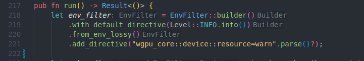
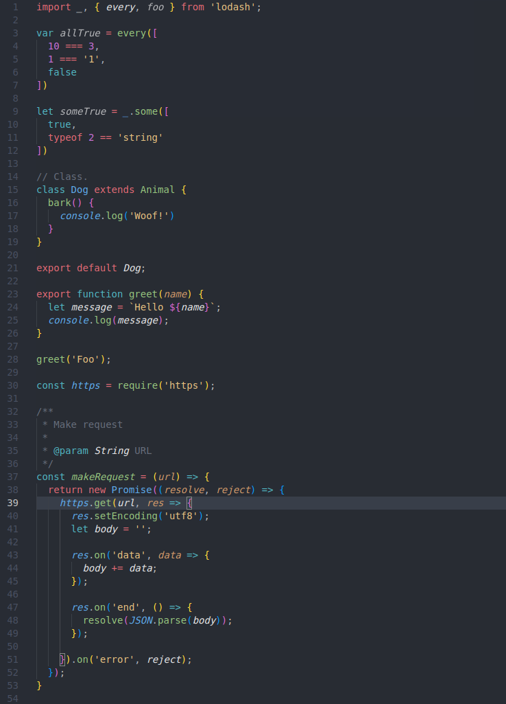

# Chu One Monokai Theme

Slightly changed [One Monokai theme](https://github.com/azemoh/vscode-one-monokai/blob/master/CHANGELOG.md) a mix between Monokai and One Dark theme


## Install

press `ctl/command + p` to launch quick open then run
```
ext install chu-one-monokai
```

## Screenshot
Screenshot of Ruby and JavaScript





## Change log
You can take a look at the change log [here](https://github.com/azemoh/vscode-one-monokai/blob/master/CHANGELOG.md)
